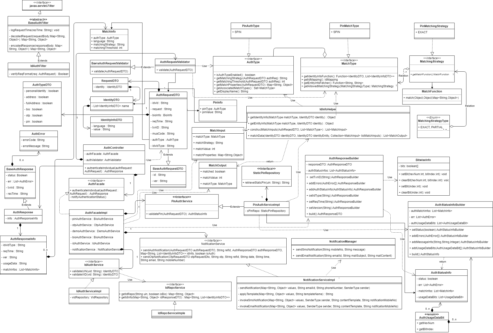
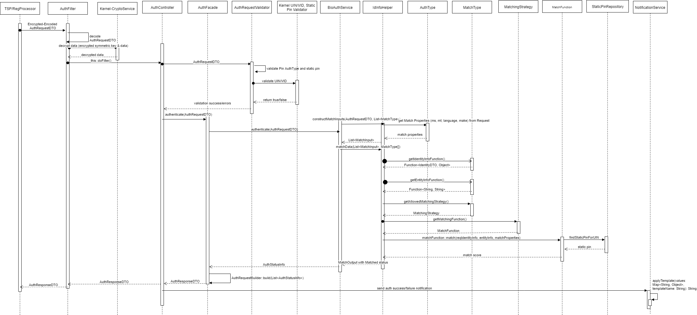

# Static Pin Auth REST Service

*Note: This service is NOT part of V1, and hence not updated. Static pin DB related tables are removed for V1.*

**1. Background**

Static Pin Auth REST service can be used to authenticate an Individual using the static pin that is stored already for the individual using [Static Pin Storage](https://github.com/mosip/mosip/wiki/ID-Authentication-APIs#3-static-pin-storage).

***1.1.Target users -***  
TSP can use Auth service to authenticate an Individual by using one or more types of authentication supported by MOSIP and retrieve Auth details as a response.

 ***1.2. Key requirements -***   
-	TSP can authenticate an Individual using one or more authentication types
-	TSP will send Individual's UIN/VID to enable authentication of Individual
-	TSP will send muaCode and msaCode to authenticate and authorize a TSP to authenticate an Individual
-	Check Individual's UIN/VID for authenticity and validity
-	Validate biometric details of the Individual against the one stored in database
-	Inform authentication status (success/failure) to the Individual in the form of message and/or email

***1.3. Key non-functional requirements -***   
-	Log :
	-	Log each stage of authentication process
	-	Log all the exceptions along with error code and short error message
	-	As a security measure, Individual's UIN or PI/PA should not be logged
-	Audit :
	-	Audit all transaction details during authentication process in database
	-	Individual's UIN should not be audited
	-	Audit any invalid UIN or VID incidents
-	Exception :
	-	Any failure in authentication/authorization of TSP and validation of UIN and VID needs to be handled with appropriate error code and message in Auth response
	-	Any error in Individual authentication also should be handled with appropriate error code and message in Auth Response 
-	Security
	-	Auth details of an individual is a sensitive information, hence should be encrypted before sending to TSP
	-	Auth Request contains sensitive identity information of an Individual. This information should be encrypted by TSP before sending to IDA. On receiving this request, TSP should decrypt identity element before validating Individual's details for authentication purpose 

**2. Solution**   
1.	TSP needs to construct a POST request with below details and send to Request URL identity/auth    
[ID Authentication API - Sample Request](https://github.com/mosip/mosip-docs/wiki/ID-Authentication-APIs#post-idauthenticationv1auth)
2.	Authenticate and Authorize TSP <<TBD>>
3.	Validate *reqTime* for incoming Auth Requests for valid format and timestamp < 24 hours (configurable value) from current time
4.	Integrate with Kernel UIN Validator and VID Validator to check UIN/VID for validity. Validate UIN/VID for authenticity in AuthDB
5.	Once the above validations are successful, Auth request is then validated based on Static Pin authentication present in input request.   
6.	Retrieve Identity details of the Individual based on UIN from ID Repository
7.	Retrieve mode of communication with Individual using admin config to send authentication success/failure information
8.	When the Individual is successfully authenticated based on one or more of the above authentication types, a sms/email notification is sent to them using Kernel's SmsNotifier and EmailNotifier to their stored phone/email respectively.
9.	Respond to TSP with below success Auth response - 
[ID Authentication API - Sample Response] https://github.com/mosip/mosip/wiki/ID-Authentication-APIs#sample-response

**2.1. Class Diagram:**   
The below class diagram shows relationship between all the classes which are required for Static Pin authentication service.

**2.2. Sequence Diagram:**   

