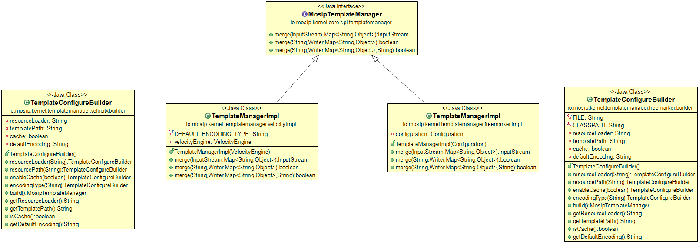

##Template Manager

####background:
Applications generate automatic emails for account signup, password reminders or automatically sent reports and notification. Using template engine, the email and notification template can be stored in a text file rather than directly embedded in your Java code, it will separate the representation and data

**Template engine consist of at least these primary elements:**
* An associated **data model**.
* One or more **source templates**.
* A processor or **template engine**.
* Generated output in the form of **processed template**.

####Solution:
The key solution considerations are 
-	Create a project which parse the template using template engine like velocity template engine or freemarker template processor.
-	The jar of the template-manager can parse the template in their respective modules. Once the kernel’s template manager jar file added into class path.

####The solution can be
-	Create a project that configure template in their module, add the template manager in class path and configure the MosipTemplateManager.
-	Create a wrapper interface in MOSIP template manager, which can parse /merge the template.
-	Configure the template and data which you can pass to template manager.

####Class Diagram:

