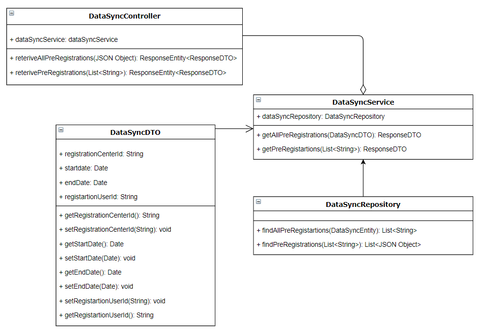

# Approach for Data Sync with Registartion Client

**Background**
- Exposing the API to Registration client will provide with the list of Pre-Registration IDs for which they wants to get Pre-Registration Data.

The target users are -
   - Registration Client 

The key requirements are -
-   Create the REST API to Registration client will provide with the list of Pre-Registration IDs for which it wants to get Pre-Registration Data.

- Pre-Registration will provide a file per Pre-Registration ID consisting of
     - Demographic Data
     - Documents
     - Appointment Time.

- Pre-Registration send zip file per Pre-Registration IDs consisting of Demographic Data, Documents, Appointment Time.

The key non-functional requirements are

-   Security :

    -  The Pre-Registartion securly share the pre-registartion data to registration client.

-   Log the each state of the data sync:

    -   As a security measures the Pre-Id or applicant information should
        not be logged.

-   Audit :

    -   User ID, RC ID, Transaction ID, Timestamp should be stored into the DB
        for audit purpose.

    -   Pre-reg Id and important detail of the applicant should not be audited.

-   Exception :

    -   Any exception occurred during the pre-registration data sync, the same will be reported to the registartion client in a understandable exception.

**Out of scope are -**

- Key management for decrypting JSON.

- decrypting the demograpgic JSON object and uploaded document and stored it in database and send as zip.

**Solution**

**Reterive all pre-registration Ids :**

-   Create a REST API as '/reteriveAllPreRegistrationIds' accept the Data Sync JSON object  from the registration-client application portal.

- The JSON object contains Registration Center ID, Date Range(Start Date, End Date) for the List of Pre-Registrations, User ID( Registration Officer/Supervisor). 

- The System will generate a Transaction ID and  fetch all the Pre-Registrations within the Date Range(Start Range, End Date) and for the Registration Center ID received.

-  The System will calculate the count of the Pre-Registration IDs being sent.

-  The System will send the List of Pre-Registration Ids, count of Pre-Registrations and transaction id in response entity .

-   Audit the exception/start/exit of the each stages of the data sync mechanism using AuditManager component.

**Reterive Pre-Registartions:**

-   Create a REST Service as '/reterivePreRegistrations' accept the list of pre-registartion ids from the registration-client application portal.

- The System will generate a Transaction ID and do the following operation need to be happen for each pre-registartion ids:

	 Step1: fetch all the demographic JSON object and appointment date time and decrypt JSON object , if successful go to next step otherwise throw an exception.

	 Step2: fetch all the document and decrypt it, if successful go to next step otherwise throw an exception.

	 Step3: preapre a zip file and ResponseDTO.{zip file structure need to discuss}

-   Audit the exception/start/exit of the each stages of the data sync mechanism using AuditManager component.

**Class Diagram**

**Sequence Diagram**

**Success / Error Code** 
   - While processing the Pre-Registration if there is any error or successfully then send the respective success or error code to the UI from API layer as  Response object.

  Code   |       Type  | Message|
-----|----------|-------------|
  0000      |             Success |   Packet Successfully created

**Dependency Modules**

Component Name | Module Name | Description | 
-----|----------|-------------|
  Audit Manager     |   Kernel        |    To audit the process while data sync.
  Exception Manager  |  Kernel     |       To prepare the user defined exception and render to the user.
  Log        |          Kernel         |   To log the process.
  Database Access   |    Kernel      |      To get the database connectivity

**User Story References**

  **User Story No.**|**Reference Link**

  **MOS-668**      |     <https://mosipid.atlassian.net/browse/MOS-668>
