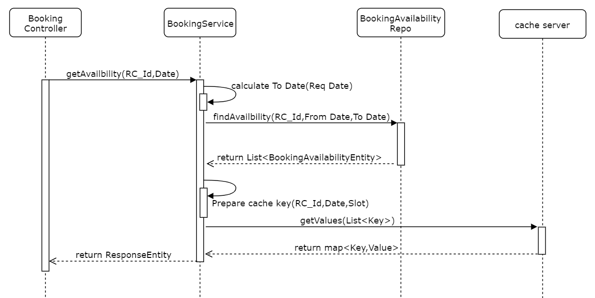

# Approach for Registration center availability

**Background**
- Exposing the REST API to get an registration center availability time slots for booking an appointment for a citizen.

The target users are -
   - Pre-Registration portal

The key requirements are -

-   Create the API to get an registration center availability time slots for booking an appointment.

-   To get an registration center availability time slots, should have the detail of:

    -   Registration center Id

    -   Date

- This ablove details need to get an registration center availability time slots.

- Need to calaculate "To Date" from the configuration and the requested Date.

- Reterive the availability time slots from database based on the requested registration center id and the date.

- A key should get generate with Registration center id, date and a time slot. with this generated key cache should get the value.

-  Once the values fetched from the cache. with this values send the response.

The key non-functional requirements are

-   Log the each state of the pre-registration creation:

    -   As a security measures the Pre-Id or applicant information should
        not be logged.

-   Audit :

    -   Each state of the Registration center availability time slots service should be stored into the DB for audit purpose.

    -   Pre-reg Id and important detail of the applicant should not be audited.

-   Exception :

    -   Any exception occurred during the registration booking, the same will
        be reported to the user with the user understandable exception.

**Solution**

**Booking an appointment :**

-   Create a REST API as '/bookingAvailability' accept the Registration center id, current system date time from the pre-registration application portal.

- Need to calaculate "To Date" from the configuration and the requested Date.

- Reterive the availability time slots from database based on the requested registration center id and the date.

-  Generate an cache key using Registration center id, booking date time and slot.

-   Once the key generated successfully update the cache using the generated key get the values.

-   Prepare an response with the fetched values and send this reponse to this API call.

-   Audit the exception/start/exit of the each stages of the Registration center availability mechanism using AuditManager component.

**Class Diagram**

**Sequence Diagram**

**Success / Error Code** 

 While processing the Registration client avilability service if there is any error or successfully then send the respective success or error code to the UI from API layer as Response object.

  Code   |       Type  | Message|
-----|----------|-------------|
  PRG_PAM_RCI-001 |  Error   |   User has not been selected any time slot.
  PRG_PAM_RCI_002  | Error   |   Appointment time slot is already booked.
  PRG_PAM_RCI_003  | Error   |   Appointment time slot is already canceled.
  PRG_PAM_RCI_004  | Error   |   Appointment can not be canceled.
  PRG_PAM_RCI_005  | Error   |   Appointment Rebooking cannot be done.
  PRG_PAM_RCI_006  | Error   |   Registration Center data not found.

**Dependency Modules**

Component Name | Module Name | Description | 
-----|----------|-------------|
  Audit Manager     |   Kernel        |    To audit the process while fetching registration center availability.
  Exception Manager  |  Kernel     |       To prepare the user defined exception and render to the user.
  Log        |          Kernel         |   To log the process.
  Database Access   |    Kernel      |      To get the database connectivity

**User Story References**

  **User Story No.** |  **Reference Link** |
  -----|----------|
  **MOS-663**      |     <https://mosipid.atlassian.net/browse/MOS-663>