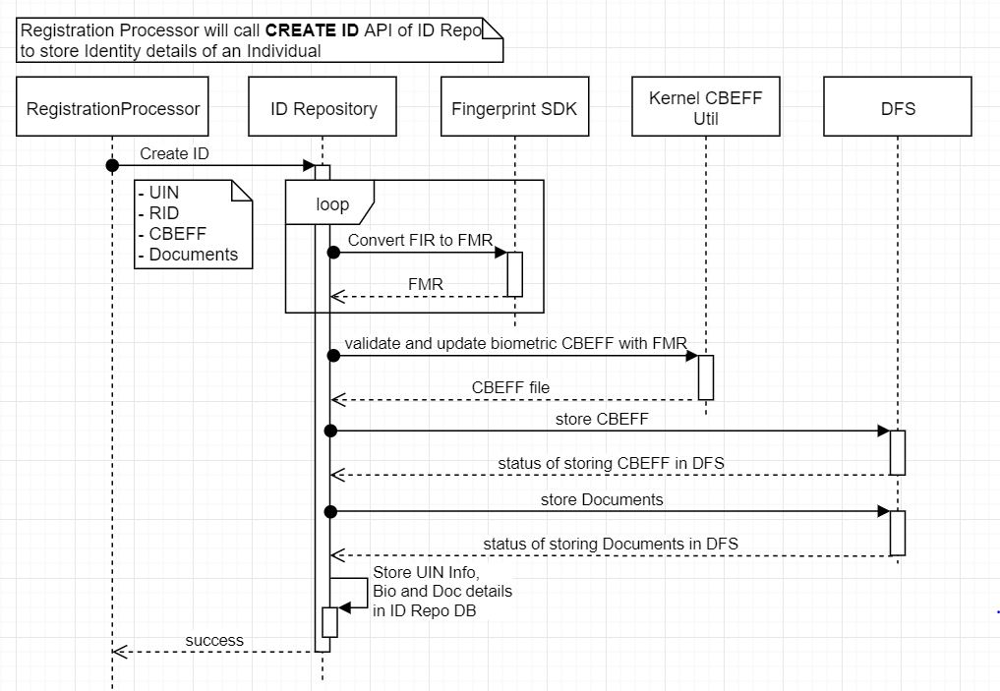
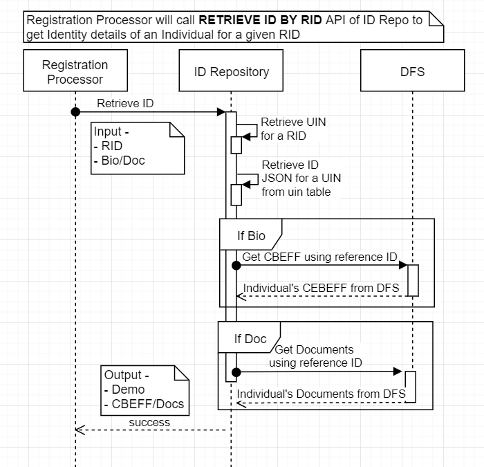
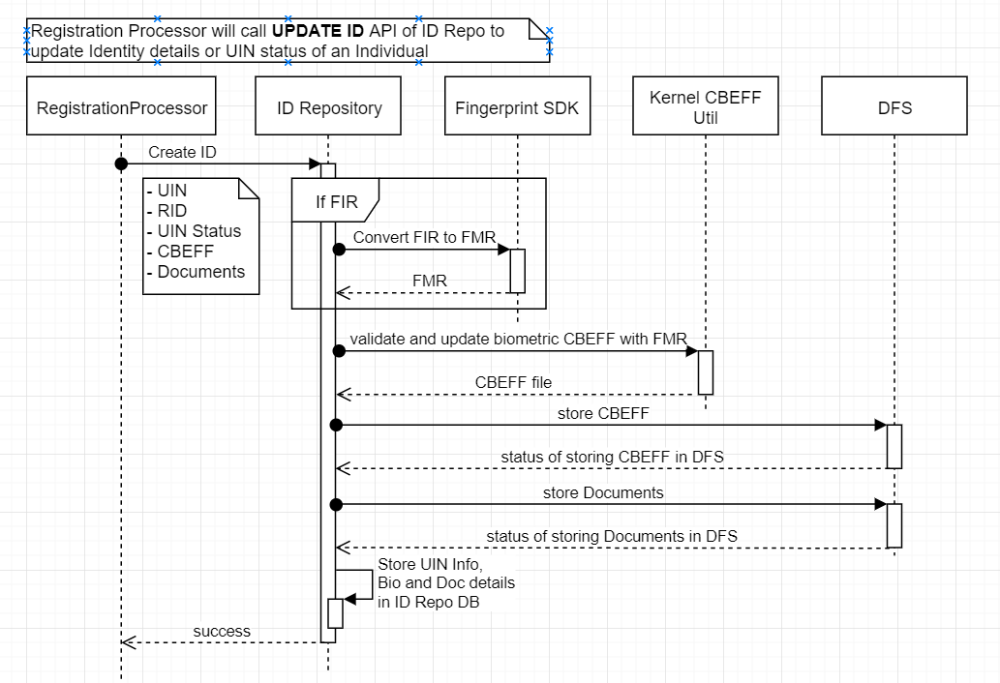
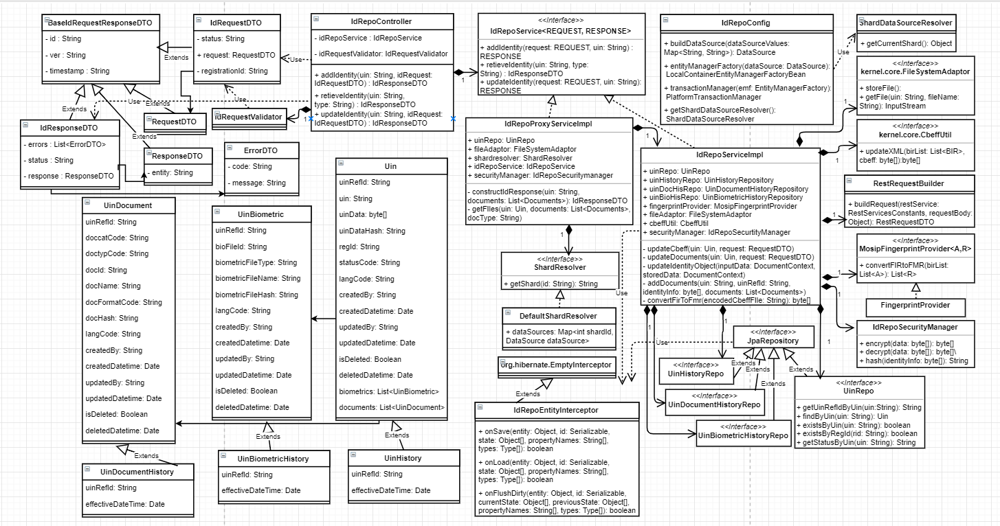
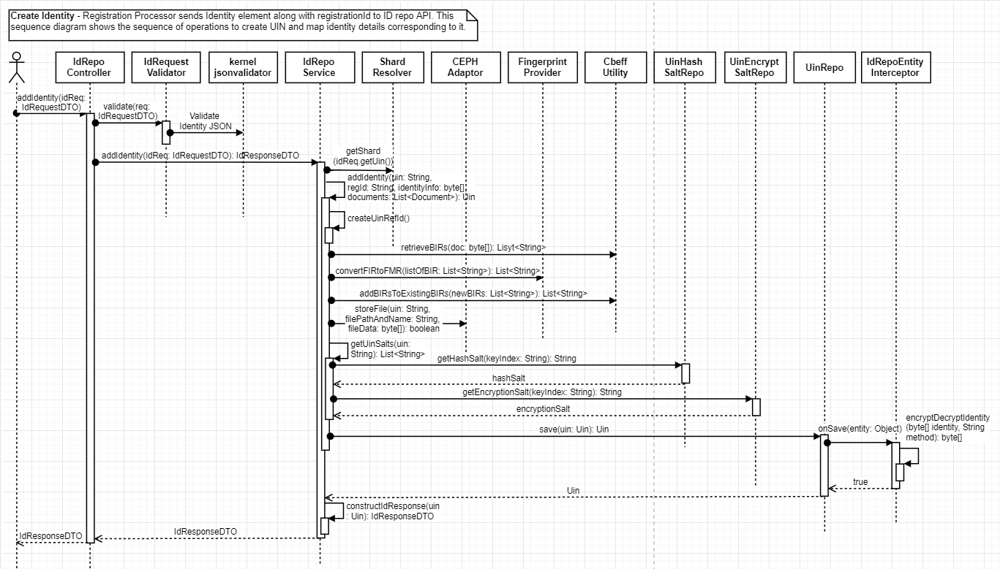
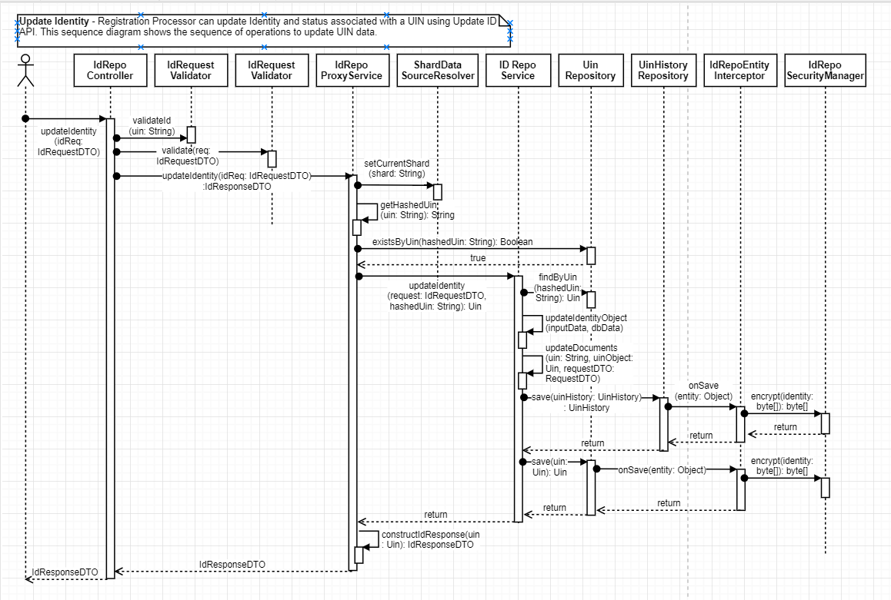
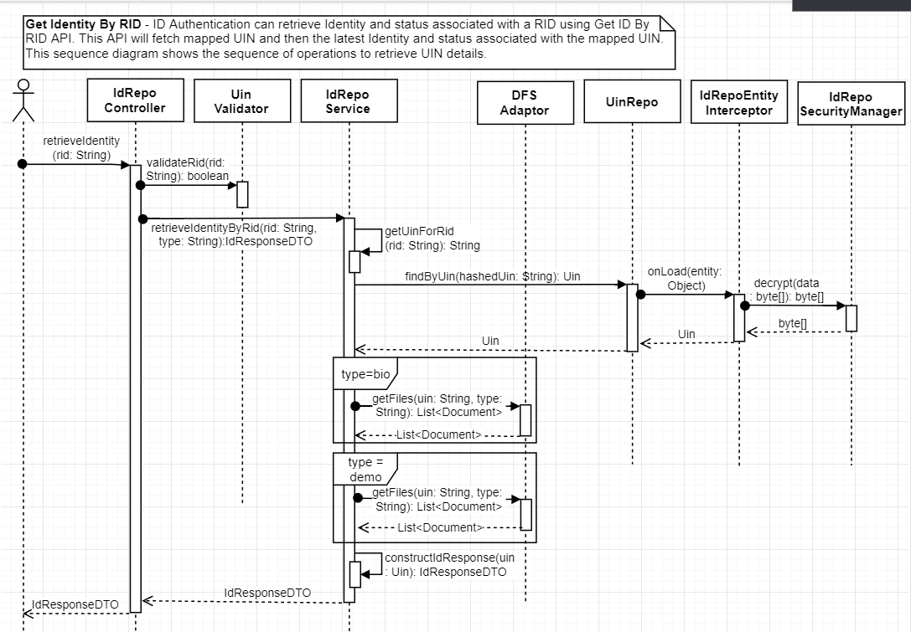
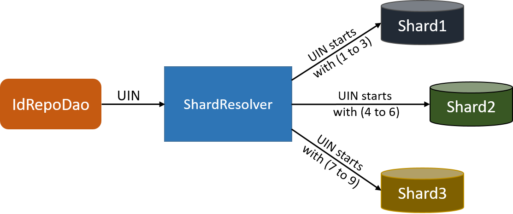

# Identity Repository Service

## 1. Background       

Identity Repository service can be used internally by modules to create, read and update Identity information and to validate an input UIN. 

***1.1.Target Users -***  
- Registration Processor can use Identity Repo services to create and update Identity information associated with a UIN   
- ID Authentication can use Identity Repo services to validate an input UIN and read identity details associated with a UIN   
- Resident Services can use Update ID API when an Individual requests for updating ID details like address   

***1.2. Key Functional Requirements -***   
-	Store identity information for a given UIN
-	Update Identity information partially or status of UIN
-	Read Identity Information associated with a valid UIN
-	Read Identity Information for a given RID
-	Check status of UIN for validating a UIN    

#### 1.2.1. Functional Flow Diagram - Create ID - 
      

#### 1.2.2. Functional Flow Diagram - Retrieve ID By UIN - 
 

#### 1.2.3. Functional Flow Diagram - Retrieve ID By RID - 
 

#### 1.2.4. Functional Flow Diagram - Update ID - 
 

***1.3. Key Non-Functional Requirements -***   

-	Logging :
	-	Log all the exceptions along with error code and short error message
	-	As a security measure, Individual's UIN should not be logged
-	Audit :
	-	Audit all transaction details in database
	-	Individual's UIN should not be audited     
-	Exception :
	-	Any error in storing or retrieval of Identity details should be handled with appropriate error code and message in the response  
-	Security :    
	-	Individual's UIN should not be visible, and should be encrypted

### 2.	Solution    

The key solution considerations are   
- Create a project which provides REST service to create, update and get Identity of Individual         
- REST service can be used by any MOSIP module to access these services through HTTP client         

**2.1.	Class Diagram**   
   

**2.2.	REST Services**   

***2.2.1.	Create Identity***     

MOSIP Mosules can use ID Repo API spec available here - [Create ID API Spec](https://github.com/mosip/mosip/wiki/ID-Repository-API#create-id) - to create Identity of an Individual    

1. 	Receive RID, ID JSON, CBEFFs and associated documents of proofs
2. 	Integrate with kernel-idvalidator-uin, kernel-idvalidator-rid to validate incoming UIN and RID
3.	Store RID, ID JSON in database, CBEFF and documents of proofs in DFS
4. 	Below are the various UIN status, which are configurable and can be modified by the country as needed -       
a.	_ACTIVATED_   
b.	_BLOCKED_   
c.	_DEACTIVATED_   
5. 	Once UIN details are stored in UIN and UIN_detail table, assign _ACTIVATED_ as UIN status   

Below sequence diagram for create Identity service shows sequence of operations to create UIN and store corresponding Identity details.   
      

***2.2.2.	Update Identity***   

MOSIP Products can use ID Repo API spec available here - [Update ID API Spec](https://github.com/mosip/mosip/wiki/ID-Repository-API#update-id) - to update Identity of an Individual    
1. 	Receive RID and ID JSON or CBEFF or associated documents of proofs
2.	Integrate with Kernel UIN validator to validate UIN     
3.	Once the request is successfully validated, update Identity details in UIN and UIN_detail tables, CBEFF and documents of proof in DFS, and biometric and document references in uin_biometric and uin_document tables respectively.   
 
Below sequence diagram for Update Identity service shows sequence of operations to update Identity details associated with a UIN.   
   

When UIN status is updated using Update ID API, the status is first validated against the configured status for the country. Once input UIN status matches the one among all the configured UIN status, it is updated in the database. 
Default configuration of UIN status has ACTIVATED, BLOCKED and DEACTIVATED. This can be changed based on country's requirements.       

***2.2.3.	Get Identity By UIN***   

MOSIP Products can use ID Repo API spec available here - [Retrieve ID By UIN API Spec](https://github.com/mosip/mosip/wiki/ID-Repository-API#read-id-by-uin) - to retrieve Identity of an Individual by providing a UIN.    
1. 	Integrate with Kernel UIN validator to validate UIN     
2.	Once the request is successfully validated, retrieve Identity details in UIN and UIN_detail tables   

Below sequence diagram for create Identity service shows sequence of operations to retrieve Identity details associated with a UIN.   
    

***2.2.4.	Get Identity By UIN***   

MOSIP Products can use ID Repo API spec available here - [Retrieve ID By RID API Spec](https://github.com/mosip/mosip/wiki/ID-Repository-API#read-id-by-rid) - to retrieve Identity of an Individual by providing a RID.    
1. 	Integrate with Kernel RID validator to validate RID     
2.	Once the request is successfully validated, retrieve latest Identity details to the mapped UIN from UIN and UIN_detail tables   

Below sequence diagram for create Identity service shows sequence of operations to retrieve Identity details associated with a UIN.   
    

**2.3.	Database Sharding**    

UIN DB stores UIN and the corresponding identity details. In order to decrease load and increase search performance, UIN DB is horizontally partitioned into shards. Each shard is a separate database instance with same tables and rows in tables are distributed across shards.
ID Repo provides default shard implementation where shards are decided based on starting character of UIN. Below diagram shows the approach for sharding UIN DB.

   

**2.4.	Encrypting/Decrypting Identity**    

Identity stored in UIN DB is encrypted/decrypted outside the DB. Details on the approach of encryption/decryption is available here - [Identity Encryption/Decryption](https://github.com/mosip/mosip/wiki/Security#database-encryption)

**2.5.	Database Model**

ID Repo DB contains tables to store ID JSON, references to CBEFF and proof documents in DFS and salts to be used for hashing and encrypting UIN. Details DB model is as below.
  