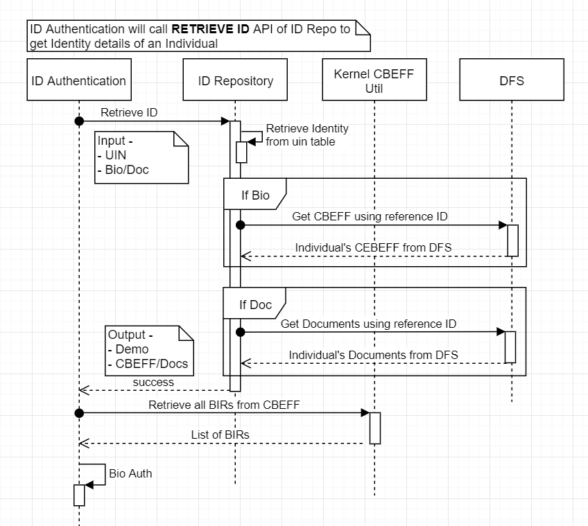

# Virtual Identity Service

## 1. Background       

Virtual Identity (VID) services can be used internally by modules to create VID based on VID Policy, retrieve UIN mapped to a VID and update VID attributes like VID status. 

***1.1.Target Users -***  
- Registration Processor can use VID services to create Perpetual VID associated with a UIN     
- Resident Services can use VID services to create Temporary VID, revoke or re-generate a VID     
- ID Authentication can use VID services to retrieve UIN associated with a VID    

***1.2. Key Functional Requirements -***   
-	Create and store VID mapped to an active UIN
-	Retrieve UIN for an active VID
-	Update VID status for an active VID

#### 1.2.1. Functional Flow Diagram - Create VID - 
      

#### 1.2.2. Functional Flow Diagram - Retrieve UIN By VID - 
 

#### 1.2.3. Functional Flow Diagram - Update VID Status - 
 

#### 1.2.4. Functional Flow Diagram - Re-generate VID - 
 

***1.3. Key Non-Functional Requirements -***   

-	Logging :
	-	Log all the exceptions along with error code and short error message
	-	As a security measure, Individual's UIN should not be logged
-	Audit :
	-	Audit all transaction details in database
	-	Individual's UIN should not be audited     
-	Exception :
	-	Any error in storing or retrieval or updation of VID details should be handled with appropriate error code and message in the response  
-	Security :    
	-	Individual's UIN should not be visible, and should be encrypted in the database

### 2.	Solution    

The key solution considerations are   
- Create a project which provides REST service to create VID, update VID status and get UIN mapped to VID    
- REST service can be used by any MOSIP module to access these services through HTTP client         

**2.1.	Class Diagram**   
TBD  

**2.2.	REST Services**   

***2.2.1.	Create VID***     

MOSIP Modules can use VID API spec available here - [Create VID API Spec](https://github.com/mosip/mosip/wiki/ID-Repository-API#create-vid) - to create Virtual Identity of an Individual, based on a given VID Policy.    

1. 	Receive UIN and VID Type as an input to generate a VID
2. 	Integrate with kernel-idvalidator-uin to validate incoming UIN
3.	Integrate with ID Repository Identity service to validate if input UIN is ACTIVE
4.	Integrate with kernel-idgenerator-vid to generate VID string
5.	Create VID based in VID policy associated with input VID Type, and store with status _ACTIVE_

***2.2.2.	Retrieve UIN for a given VID***   

MOSIP Modules can use VID API spec available here - [Update ID API Spec](https://github.com/mosip/mosip/wiki/ID-Repository-API#retrieve-uin-by-vid) - to retrieve Virtual Identity of a given UIN.   

1. 	Receive VID and VID status as input
2.	Check if VID status is _ACTIVE_ and then update the status as present in input.
3.	Handle below cases for updating VID status -    
a.  If input VID status is _REVOKED_ and input VID is of _Perpetual_ Type, then create a new VID and store
b.  If input VID status is _REVOKED_ and input VID is of _Perpetual_ Type, then create a new VID and store

